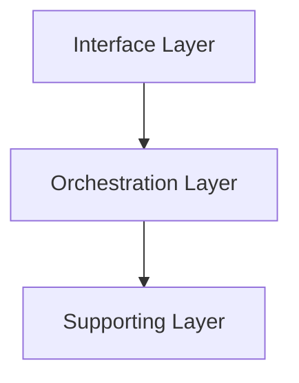

# 页面集合与启发式规则

指导 Agent **如何根据 `doc_plan.json` 决定写哪些页面**、合并/拆分策略、以及置信度管理。

本文档的分类体系参考了 [DeepWiki](https://deepwiki.com/) 的设计模式——特别是 [shanraisshan/claude-code-best-practice](https://deepwiki.com/shanraisshan/claude-code-best-practice)（工具型项目标杆）和 [huggingface/transformers](https://deepwiki.com/huggingface/transformers)（大型库/框架标杆）。

---

## 1. 必读输入

| 文件 | 核心字段 |
|------|----------|
| `doc_plan.json` | `section`, `slug`, `required`, `evidence`, `hints` |
| `repo.json` | `signals`（技术栈标签） |
| `structure.json` | `topLevel`, `configFiles`, `fileStats`, `largestFiles` |
| `entrypoints.json` | `candidates`, `routes`, `stateManagement`, `networkLayer`, `components` |
| `imports.json` | `hubFiles`, `heavyImporters`, `topExternalDeps` |
| `complexity.json` | `hotspots`, `functionLengths`, `deepNesting`, `summary` |
| `types.json` | `coreInterfaces`, `typeFiles`, `enumDefinitions`, `summary` |
| `violations.json` | `circularDeps`, `layerViolations`, `godFiles`, `orphanFiles` |
| `api-surface.json` | `exportedFunctions`, `exportedHooks`, `exportedComponents`, `barrelFiles` |
| `dep-health.json` | `directDeps`, `devDeps`, `heavyDeps`, `duplicateRisk` |
| `test-coverage.json` | `testFiles`, `sourceToTestMap`, `untestedSources`, `testFrameworks` |
| `git-activity.json` | `hotFiles`, `recentChanges`, `contributors`, `commitFrequency` |
| `execution-flows.json` | `processes`, `keyFlows`, `summary` |

规则：
- `evidence` 为空 **且** `required: false` → **跳过**该页，在 `quality-report.md` 说明
- `required: true` 的页面即使证据较薄也要写（可降低篇幅，标注待验证）
- Agent **可追加**新页面（如发现了脚本未覆盖的子系统），需遵守编号和路径规则

---

## 2. 分类体系设计原则（DeepWiki 标杆）

DeepWiki 优秀项目的分类体系遵循 **「自上而下、由浅入深」** 的认知顺序，具有以下设计原则：

### 2.1 三层认知递进

```
入门层（What）→ 概念层（How）→ 深入层（Why & Reference）
```

| 层级 | 对应 Section | 读者目标 |
|------|-------------|----------|
| **入门层** | 1 Overview, 2 Getting Started | 30 秒理解项目是什么、5 分钟跑起来 |
| **概念层** | 3 Core Concepts, 4 Configuration, 5 Context Management | 理解核心抽象和配置体系 |
| **深入层** | 6 Architecture Patterns, 7 Extension Mechanisms, 8 CLI | 掌握高级模式和扩展点 |
| **实战层** | 9 Workflows, 10 Best Practices | 实际开发中的最佳实践 |
| **速查层** | 11 Reference, 12 Glossary | 快速查阅 API、配置项、术语 |

### 2.2 父子页面结构

DeepWiki 的每个 Section 都有一个**概览父页面**和多个**子话题页面**：

- 父页面（如 `3-core-concepts`）：鸟瞰全局，用 Mermaid 关系图展示子概念间的关系，每个子概念只用 3-5 行介绍 + 交叉引用链接
- 子页面（如 `3.1-commands`、`3.2-agents`）：深入单个话题，包含完整的配置示例、执行流程图、对比矩阵

### 2.3 交叉引用模式

每个页面应使用以下格式建立交叉引用网络（对标 DeepWiki 的 "For details, see X" 模式）：

```markdown
关于具体配置方法，详见 [配置系统](../configuration/4-configuration-system.md)。
```

### 2.4 按子系统组织（大型库适配）

对于大型库或框架（如 transformers、React、Vue），通用分类（overview/architecture/modules/dataflow）**不够贴切**——应该按**功能子系统**划分 Section。这是从 [huggingface/transformers](https://deepwiki.com/huggingface/transformers) 提炼的模式。

通用分类 vs 子系统分类对比：

| 策略 | 适用场景 | Section 示例 |
|------|----------|-------------|
| **通用分类** | 应用型项目（SPA、CLI 工具） | Overview → Architecture → Modules → Data Flow |
| **子系统分类** | 大型库/框架 | Core Architecture → Training System → Generation System → Model Architectures |

子系统分类原则：
1. **按 pipeline 阶段划分**：加载 → 训练 → 推理 → 部署（ML 库）；解析 → 编译 → 渲染 → 部署（前端框架）
2. **每个子系统对应一个 Section**：拥有独立的父页面 + 子页面
3. **共享基础设施独立成 Section**：如 Core Architecture（模型/配置/tokenizer 基类）
4. **深度子页面拆分**：单个 Section 可拆出 5-9 个子页面（如 Model Architectures 按架构族拆分）

### 2.5 Sources 双层引用

DeepWiki 使用两层引用系统：
1. **Relevant source files**（页面开头）：列出该页面涉及的所有源文件
2. **Sources**（每个小节末尾）：精确到行号，标注该小节论断的代码依据

```markdown
**Sources:** `src/router/index.ts:12-45`, `src/config/settings.json:1-30`
```

---

## 3. 完整分类体系（13 Section）

以下为 DeepWiki 风格的完整分类。Agent 应根据项目的实际复杂度**选择性生成**——小型项目可合并或跳过部分 Section。

### Section 1 — Overview（项目地图）

| section | slug | 目的 | 无证据时的行为 |
|---------|------|------|----------------|
| 1 | `overview/introduction` | 新人第一张图 | 仍写极简版（基于 `structure.json`） |
| 1.1 | `overview/monorepo-layout` | 工作区布局 | 仅 Monorepo 项目生成 |
| 1.x | `overview/tech-stack` | 技术栈明细 | 始终写（至少有 `package.json`） |

### Section 2 — Getting Started（快速上手）

| section | slug | 目的 | 无证据时的行为 |
|---------|------|------|----------------|
| 2 | `getting-started/quick-start` | 安装与运行 | 有 `package.json` scripts 即写 |
| 2.1 | `getting-started/installation` | 详细安装步骤 | 有依赖管理工具即写 |
| 2.2 | `getting-started/repository-structure` | 仓库结构速查 | 始终写（基于 `structure.json`） |

### Section 3 — Core Concepts（核心概念）

| section | slug | 目的 | 无证据时的行为 |
|---------|------|------|----------------|
| 3 | `concepts/core-concepts` | 概念关系鸟瞰 | 始终写——概念总是存在的 |
| 3.x | `concepts/{concept-name}` | 单个核心概念深入 | 每个核心抽象一篇，按重要性排序 |

父页面应包含一个 **Comparison Matrix**（对比矩阵），用表格对比所有核心概念：

```markdown
| 概念 | 文件位置 | 上下文 | 调用方式 | 用途 |
|------|----------|--------|----------|------|
| Commands | `.claude/commands/` | 当前会话 | 用户 `/command` | 工作流编排 |
| Agents | `.claude/agents/` | 隔离上下文 | Agent 工具 | 自治执行 |
```

### Section 4 — Configuration System（配置系统）

| section | slug | 目的 | 无证据时的行为 |
|---------|------|------|----------------|
| 4 | `configuration/config-system` | 配置体系总览 | 有配置文件即写 |
| 4.1 | `configuration/settings-hierarchy` | 优先级层次 | 有多层配置才拆分 |
| 4.2 | `configuration/permissions` | 权限控制 | 检测到权限配置才生成 |
| 4.3 | `configuration/environment-variables` | 环境变量 | 有 `.env` 文件即写 |
| 4.x | `configuration/{topic}` | 其他配置子话题 | 按检测到的配置种类生成 |

### Section 5 — Architecture Patterns（架构设计）

| section | slug | 目的 | 无证据时的行为 |
|---------|------|------|----------------|
| 5 | `architecture/system-architecture` | 分层与边界 | 有目录结构即可写 |
| 5.1 | `architecture/component-system` | 组件体系 | 组件 > 5 个才生成 |
| 5.2 | `architecture/routing` | 路由系统 | 检测到路由才生成 |
| 5.x | `architecture/{pattern-name}` | 其他架构模式 | 检测到典型模式才生成 |

父页面使用 **Architecture Layer Diagram**：



并附 **层级-文件映射表**（对标 DeepWiki "System Architecture Overview"）。

### Section 6 — Extension Mechanisms（扩展机制）

| section | slug | 目的 | 无证据时的行为 |
|---------|------|------|----------------|
| 6 | `extensions/extension-mechanisms` | 扩展点总览 | 有插件/Hook/中间件体系才写 |
| 6.1 | `extensions/hooks-system` | Hooks / 生命周期 | 检测到事件系统才生成 |
| 6.2 | `extensions/plugin-system` | 插件体系 | 有插件注册机制才生成 |
| 6.3 | `extensions/middleware` | 中间件链 | 检测到中间件模式才生成 |
| 6.x | `extensions/{extension-type}` | 其他扩展类型 | 按检测结果生成 |

### Section 7 — Modules（核心模块）

| section | slug | 目的 | 无证据时的行为 |
|---------|------|------|----------------|
| 7 | `modules/core-modules` | 模块总览 | 始终写 |
| 7.x | `modules/{pkg-name}` | 单个包/模块 | Monorepo 且包数 ≤ 10 才拆分 |

### Section 8 — Data Flow（数据流）

| section | slug | 目的 | 无证据时的行为 |
|---------|------|------|----------------|
| 8 | `dataflow/request-and-state` | 数据流总览 | 有状态/网络层信号才写 |
| 8.1 | `dataflow/state-management` | 状态详解 | Store 文件 > 3 才拆分 |
| 8.2 | `dataflow/api-layer` | API 层 | 检测到 API 封装才生成 |

### Section 9 — Development Workflows（开发工作流）

| section | slug | 目的 | 无证据时的行为 |
|---------|------|------|----------------|
| 9 | `workflows/development-workflows` | 工作流总览 | 有 scripts 或 CI 配置即写 |
| 9.1 | `workflows/build-and-deploy` | 构建与部署 | 有构建配置才生成 |
| 9.2 | `workflows/testing-strategy` | 测试策略 | 有测试文件时生成 |
| 9.3 | `workflows/ci-cd` | CI/CD 流程 | 有 CI 配置文件才生成 |
| 9.x | `workflows/{workflow-name}` | 其他工作流模式 | 检测到特定模式才生成 |

### Section 10 — Best Practices（最佳实践与故障排查）

| section | slug | 目的 | 无证据时的行为 |
|---------|------|------|----------------|
| 10 | `best-practices/best-practices` | 实践总览 | 有代码质量数据或架构违规时生成 |
| 10.1 | `best-practices/code-quality` | 代码质量分析 | 有复杂度数据才生成 |
| 10.2 | `best-practices/architecture-violations` | 架构违规 | 有循环依赖或层级违规才生成 |
| 10.x | `best-practices/{topic}` | 其他实践话题 | 按检测结果生成 |

### Section 11 — Reference（速查索引）

| section | slug | 目的 | 无证据时的行为 |
|---------|------|------|----------------|
| 11 | `reference/reference` | 索引总览 | 有公开 API 或配置项即写 |
| 11.1 | `reference/api-reference` | API 速查表 | 导出 > 10 才生成 |
| 11.2 | `reference/config-reference` | 配置项速查表 | 有配置文件才生成 |
| 11.3 | `reference/hooks-reference` | Hooks 速查表 | Hook 数 > 5 才生成 |
| 11.x | `reference/{ref-type}` | 其他参考类型 | 按检测结果生成 |

Reference 页面应使用**速查表格式**（对标 DeepWiki "Commands Reference"）——每个条目一行，包含名称、文件位置、用途、参数概要：

```markdown
| 名称 | 文件 | 用途 | 参数 |
|------|------|------|------|
| `useAuth` | `src/hooks/useAuth.ts` | 认证状态管理 | — |
```

### Section 12 — Glossary（术语表）

| section | slug | 目的 | 无证据时的行为 |
|---------|------|------|----------------|
| 12 | `glossary/glossary` | 术语速查 | 可选——核心概念 > 10 个才独立成页 |

术语表格式：

```markdown
| 术语 | 定义 | 首次出现 |
|------|------|----------|
| Hub 文件 | 被 5+ 其他文件导入的文件 | `imports.json` |
```

### Section 13 — Health（项目健康仪表盘）

| section | slug | 目的 | 无证据时的行为 |
|---------|------|------|----------------|
| 13 | `health/project-health` | 项目健康仪表盘 | 始终写 |
| 13.1 | `health/dependency-health` | 依赖健康详解 | 依赖 > 30 或有重量级依赖 |
| 13.2 | `health/test-coverage` | 测试覆盖分析 | 有测试文件时生成 |
| 13.3 | `health/git-activity` | Git 活跃度 | 有 Git 提交记录时生成 |
| 13.4 | `health/execution-flows` | 执行流全景 | 有 GitNexus 索引时生成 |

---

## 4. 规模适配策略

### 小型项目（< 30 源码文件）

- 合并 Section 1 + 2 为一篇「项目概览与快速上手」
- 合并 Section 5 + 8 为一篇「架构与数据流」
- 跳过 Section 6（扩展机制）、11（Reference）、12（Glossary）
- 总页数 **3-5 篇**

### 中型项目（30-300 源码文件）

- 保持 Section 1-9 的基本框架
- Section 6 按实际扩展点选择性生成
- 跳过或精简 Section 10-12
- 总页数 **6-12 篇**

### 大型项目 / Monorepo（> 300 源码文件）

- 完整覆盖 Section 1-13
- Section 7 按 workspace 包或功能域拆分
- Section 5 拆分组件体系 + 路由
- Section 11 独立 API / Config / Hooks 速查页面
- 总页数 **12-25 篇**

### 大型库 / 框架（> 500 源码文件，多子系统）

对标 [huggingface/transformers](https://deepwiki.com/huggingface/transformers) 的组织方式：

- **放弃通用分类**，改为**按子系统组织** Section（详见 §2.4）
- Section 1-2 保留（Overview + Getting Started），Section 3 起按子系统划分
- 每个子系统 Section 的父页面使用 **Component Map**（File | Responsibility 表格）
- 跨子系统的共享基础（基类、工具函数）独立成 "Core Architecture" Section
- 最后两个 Section 保留给 "Development Infrastructure"（CI/测试/贡献指南）和 "Glossary"
- 单个 Section 可拆出 **5-9 个子页面**（如按架构族、按模块类型拆分）
- 总页数 **20-40 篇**

建议的 Section 映射（以 ML 库为例）：

| Section | 对应 | 内容 |
|---------|------|------|
| 1 | Overview | 项目定位、安装、技术栈 |
| 2 | Core Architecture | 模型基类、配置、Tokenizer |
| 3 | Training System | Trainer、优化器、数据加载 |
| 4 | Generation System | 推理、解码策略、缓存 |
| 5 | Model Architectures | 按架构族拆分（Encoder、Decoder、Encoder-Decoder、Vision...） |
| 6 | Advanced Features | Pipeline、量化、分布式 |
| 7 | Development Infrastructure | CI、测试、代码规范 |
| 8 | Glossary | 术语 + Code Entity Mapping |

### 非前端项目（CLI / 库 / 后端）

- 跳过 Section 5.1（组件体系）、5.2（路由）
- 重点关注 Section 6（扩展机制）、11（API Reference）
- Section 8 改为「API 设计与协议」
- 视项目性质调整 Section 命名

### 微前端 / 多入口

- Section 8 数据流用多张 sequence 图，每张对应一个**用户旅程**
- 不要混在一张图里

---

## 5. DeepWiki 核心写作模式

### 5.1 Comparison Matrix（对比矩阵）

在概念对比、技术选型、配置差异等场景，**必须使用表格**而非分散段落。

示例（对标 DeepWiki "Commands vs Agents vs Skills"）：

```markdown
| 特性 | Commands | Agents | Skills |
|------|----------|--------|--------|
| **调用** | 用户 `/` | Agent 工具 | Skill 工具 |
| **上下文** | 当前会话 | 隔离 Fork | 当前会话（默认）|
| **内存** | 无 | 持久 MEMORY.md | 无 |
| **适用场景** | 入口编排 | 自治多步任务 | 可复用知识 |
```

### 5.2 Architecture Layer Table

每个架构概览页面应包含 **层级-文件-用途** 三列映射表：

```markdown
| 层级 | 文件位置 | 用途 |
|------|----------|------|
| Interface | CLI, slash commands | 用户交互入口 |
| Orchestration | `.claude/commands/`, `.claude/agents/` | 工作流执行 |
| Supporting | `CLAUDE.md`, `.claude/settings.json` | 上下文与配置 |
```

### 5.3 Configuration Hierarchy Table

配置系统页面应包含 **优先级-文件-范围-Git追踪** 的精确对照表：

```markdown
| 优先级 | 文件/来源 | 范围 | Git 追踪 | 说明 |
|--------|-----------|------|----------|------|
| 1（最高） | 组织策略 | 全组织 | N/A | 无法覆盖 |
| 2 | CLI 参数 | 单次会话 | N/A | 临时覆盖 |
| 3 | `.local.json` | 项目 | 否 | 个人偏好 |
```

### 5.4 Execution Flow Pattern

描述动态行为时，使用 **编号步骤 + Mermaid sequence diagram** 的组合：

1. 先用编号列表概述步骤（自然语言）
2. 紧跟 Mermaid sequenceDiagram 可视化
3. 每个步骤绑定 Sources 行号

### 5.5 Section 父页面模式

每个 Section 的父页面遵循统一结构：

1. **一句话概述** — 这个域解决什么问题
2. **关系图** — Mermaid 展示子概念/子系统之间的关系
3. **子页面导航表** — 列出所有子页面及其概要
4. **Key Concepts Summary** — 用 Comparison Matrix 对比核心概念

```markdown
## 子页面导航

| 页面 | 内容 | 详见 |
|------|------|------|
| 5.1 组件体系 | React 组件分层与复用模式 | [组件体系](./5.1-component-system.md) |
| 5.2 路由系统 | React Router v6 配置与守卫 | [路由系统](./5.2-routing.md) |
```

### 5.6 Component Map（组件文件映射表）

对标 transformers "Generation System" 父页面。当一个子系统涉及多个抽象类/模块时，使用 **Component Map** 将所有抽象映射到具体代码文件位置——比单纯的关系图更实用：

```markdown
## Component Map

| 文件 | 职责 |
|------|------|
| `src/generation/utils.py` | 生成工具函数与 `GenerationMixin` 基类 |
| `src/generation/configuration_utils.py` | `GenerationConfig` 参数管理 |
| `src/generation/logits_process.py` | Logits 处理器（温度、top-k、top-p） |
| `src/generation/stopping_criteria.py` | 停止条件（最大长度、EOS token） |
| `src/generation/beam_search.py` | Beam search 解码策略 |
```

适用场景：子系统父页面、架构概览页面。

### 5.7 Architecture Family Table（架构族索引表）

对标 transformers "Model Architectures" 父页面。当一个 Section 需要按"类型族"拆分多个子页面时，使用大表格作为目录索引：

```markdown
## 架构族总览

| 架构族 | 代表模型 | 详见 |
|--------|----------|------|
| Encoder-only | BERT, RoBERTa, DeBERTa | [5.1 Encoder 架构](./5.1-encoder-models.md) |
| Decoder-only | GPT-2, LLaMA, Mistral | [5.2 Decoder 架构](./5.2-decoder-models.md) |
| Encoder-Decoder | T5, BART, mBART | [5.3 Encoder-Decoder 架构](./5.3-encoder-decoder-models.md) |
| Vision | ViT, CLIP, Swin | [5.4 Vision 架构](./5.4-vision-models.md) |
```

适用场景：模型/插件/组件等需要按类型分族展示时。

### 5.8 Method/Class 速查表

对标 transformers "GenerationMixin" 的方法列表。当某个关键类/模块的方法较多时，用表格精确到行号：

```markdown
## GenerationMixin 方法速查

| 方法 | 用途 | 位置 |
|------|------|------|
| `generate()` | 统一入口，路由到具体解码策略 | `generation/utils.py:1200-1350` |
| `_sample()` | 采样解码 | `generation/utils.py:1400-1500` |
| `_beam_search()` | Beam search 解码 | `generation/utils.py:1550-1700` |
```

适用场景：核心类详解页面、API Reference 子页面。

### 5.9 参数分组表格

对标 transformers "GenerationConfig" 的参数展示。当配置项/参数超过 15 个时，按功能分组展示：

```markdown
## 参数分组

| 分组 | 关键参数 | 说明 |
|------|----------|------|
| **基础控制** | `max_length`, `max_new_tokens`, `min_length` | 输出长度控制 |
| **采样策略** | `temperature`, `top_k`, `top_p`, `do_sample` | 随机性与多样性 |
| **Beam Search** | `num_beams`, `early_stopping`, `length_penalty` | 多候选搜索 |
| **重复控制** | `repetition_penalty`, `no_repeat_ngram_size` | 避免重复 |
```

适用场景：配置详解页面、大型 API 参数说明。

---

## 6. 置信度与诚实性

- 每篇可在文末增加 **「待验证」** 小节（checklist 格式）
- 文档与 README 冲突时，**以代码为准**并明确指出冲突点
- **不要虚构目录名或文件路径**——必须来自扫描结果或人工确认
- import 图谱基于静态分析，动态 import 和 alias 可能遗漏——在相关页面标注

---

## 7. 编号规则

- 大编号（1, 2, 3...）对应 section 主页
- 子编号（1.1, 1.2, 2.1...）对应子话题页
- 编号在 `doc_plan.json` 中由脚本自动分配，Agent 追加新页面时续接
- 文件名中编号和 slug 用 `-` 连接：`2.1-component-system.md`
- 侧栏按编号数值排序（`regenerate-sidebar.mjs` 自动处理）

---

## 8. 与 codewiki-generator 的差异

- 本 skill 使用 **纯 Node**（`analyze-repo.mjs`），无需 Python
- 分析结果更丰富：含 import 图谱、路由/状态/网络层检测、文件统计
- 页面采用**层级编号**（对标 DeepWiki），而非扁平分类
- 聚焦 VitePress 单一引擎，降低维护成本
- 若团队有自定义扫描器，保留 `doc_plan.json` 的数组结构（`section`, `slug`, `title`, `category`, `required`, `evidence`, `hints`）即可兼容
